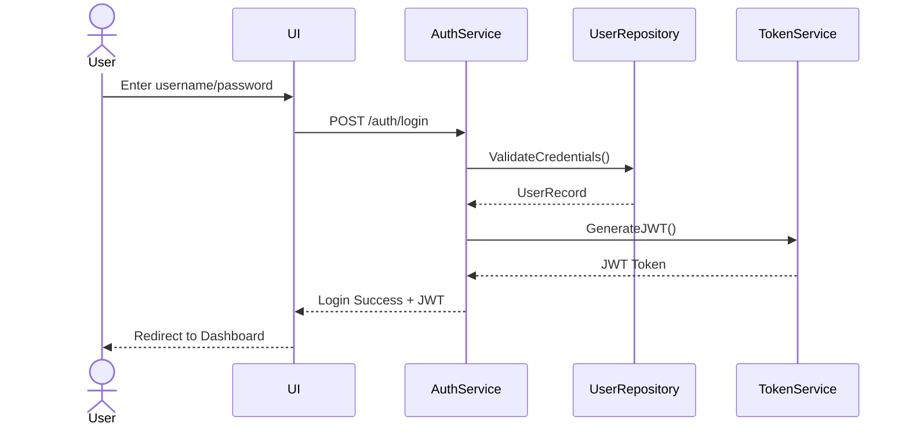
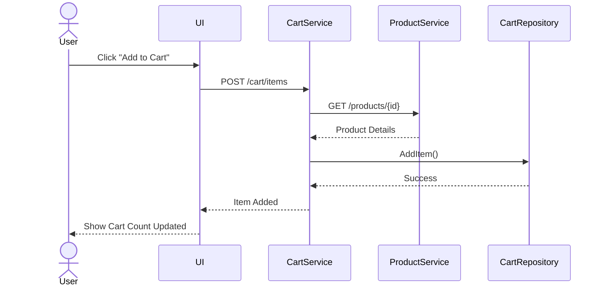
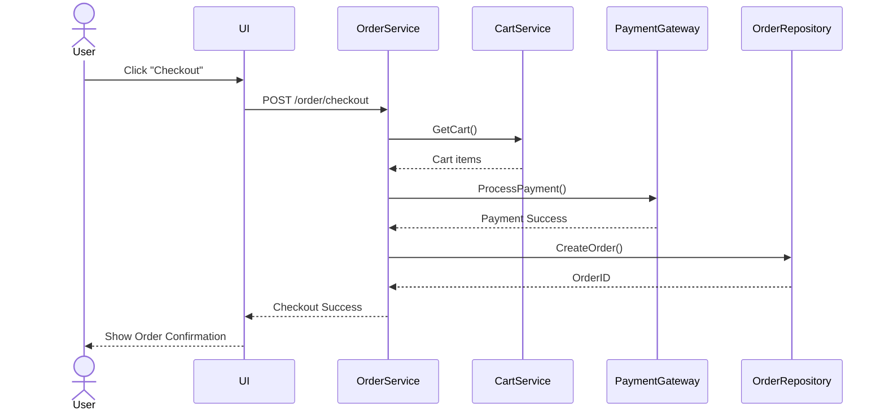
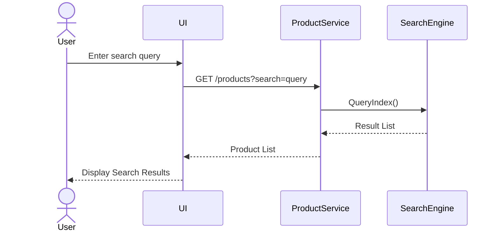

# 🧩 Sequence Diagrams
E‑Commerce Platform — Key User Flows

---
## 1. **Login Sequence Diagram**

---
## 2. **Add to Cart Sequence Diagram**

---
## 3. **Checkout Sequence Diagram**

---
## 4. **Product Search Sequence Diagram**

